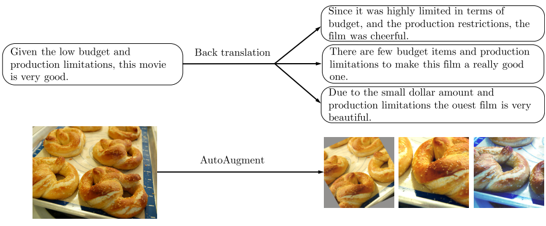
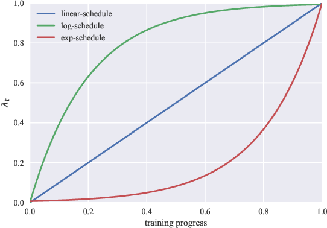

# UDA - Unsupervised Data Augmentation

[Paper](https://arxiv.org/abs/1904.12848)

[Blog Post](https://ai.googleblog.com/2019/07/advancing-semi-supervised-learning-with.html)

[Repository](https://github.com/google-research/uda)

## Overview

## Findings

1 - Matches and out performs supervised learning with less data

2 - Works for both text and vision tasks

3 - Combines well with transfer learning


## How it works

###  Loss Function

This loss function is calculated is combining two loss functions one for the supervised part of the data (labelled) and one for the unsupervised part of the data (UDA). There is also a weighting factor (lamda) applied to the UDA loss function, researchers set (lamda) to 1 for most of their experiments.
 
**Supervised Loss (Labelled Data)-**  Cross entropy loss

**Unsupervised Consistencry Loss (Unlabelled Data)** more specifically KL divergence.

```Python
# uda/image/main.py

# q_logits = augmented logits 

def _kl_divergence_with_logits(p_logits, q_logits):
    p = tf.nn.softmax(p_logits)
    log_p = tf.nn.log_softmax(p_logits)
    log_q = tf.nn.log_softmax(q_logits)
    kl = tf.reduce_sum(p * (log_p - log_q), -1)
return kl

```

KL divergence is calculated between predicted distributions on the unlabeled example and unlabeled augmented example. KL divergence works by.................


## Augmentation Strategies

Having diverse and valid augmentations are important..... why ?

Image augmentation was done using  **AutoAugment** [Paper](https://ai.googleblog.com/2018/06/improving-deep-learning-performance.html) [Medium](https://towardsdatascience.com/how-to-improve-your-image-classifier-with-googles-autoaugment-77643f0be0c9) and **Cutout** [Paper](https://arxiv.org/abs/1708.04552) was also used for experiments with CIFAR-10 and SVHN. It is noted that there is a trade off between having diverse augmented training examples while at the same time keeping the ground truth label matched. Any augmented samples where created for one ground truth and were generated before training.

Text augmentation was done using back translation and a process called TF-IDF.




## Additional Training Techniques

### Training Signal Annealing

While training there is risk for the model to overfit to the labelled training data. To negate that researches used (TSA) with the idea being to *gradually release training signals of the labeled data without overfitting as the model is trained on more and more unlabeled examples.*

When the probability of the correct category is higher the some threshold (Nt) that example is removed from the loss calculation. This threshold prevents the model from from over-training on examples it is already confident on.

There are three threshold schedules depending on the different ratios of labeled and unlabeled data.

**log-schedule** where threshold is increased most rapidly at the beginning of training. Used when the model is **less** likely to overfit because of abundance of labeled examples or effective regularizations in the model.

**exp-schedule** where threshold is increased most rapidly at the end of training. Used when the problem is **more** likely to overfit because of a relatively easy problem or the number of training examples is limited. The supervising signal get mostly released by the end of training.

**linear-schedule** where the threshold is linearly increased while training.

)


```Python
# uda/image/main.py

def get_tsa_threshold(schedule, global_step, num_train_steps, start, end):
  step_ratio = tf.to_float(global_step) / tf.to_float(num_train_steps)
  if schedule == "linear_schedule":
    coeff = step_ratio
  elif schedule == "exp_schedule":
    scale = 5
    # [exp(-5), exp(0)] = [1e-2, 1]
    coeff = tf.exp((step_ratio - 1) * scale)
  elif schedule == "log_schedule":
    scale = 5
    # [1 - exp(0), 1 - exp(-5)] = [0, 0.99]
    coeff = 1 - tf.exp((-step_ratio) * scale)
  return coeff * (end - start) + start
```

### Sharpening Predictions

- **Confidence-based masking** Predictions on the unlabelled and original data that the model is unsure about are masked and the loss is computed only on examples whose highest probability is higher then some threshold.

```python
# uda/image/main.py

ori_prob = tf.nn.softmax(ori_logits, axis=-1)
largest_prob = tf.reduce_max(ori_prob, axis=-1)
loss_mask = tf.cast(tf.greater(largest_prob, FLAGS.uda_confidence_thresh), tf.float32)
# metric_dict["unsup/high_prob_ratio"] = tf.reduce_mean(loss_mask)
loss_mask = tf.stop_gradient(loss_mask)
aug_loss = aug_loss * loss_mask
# metric_dict["unsup/high_prob_loss"] = tf.reduce_mean(aug_loss)

```

- **Entropy minimization**

- **Softmax temperature controlling**

### Domain-relevance Data filtering

If the class distribution between the labeled and unlabeled data sets are unmatched it can hurt the performance of the model. To try and match the class distributions between the labeled and unlabeled data the model was trained on the labeled samples and used to infer the unlabeled samples class, examples that the model was most confident on where then used for training.